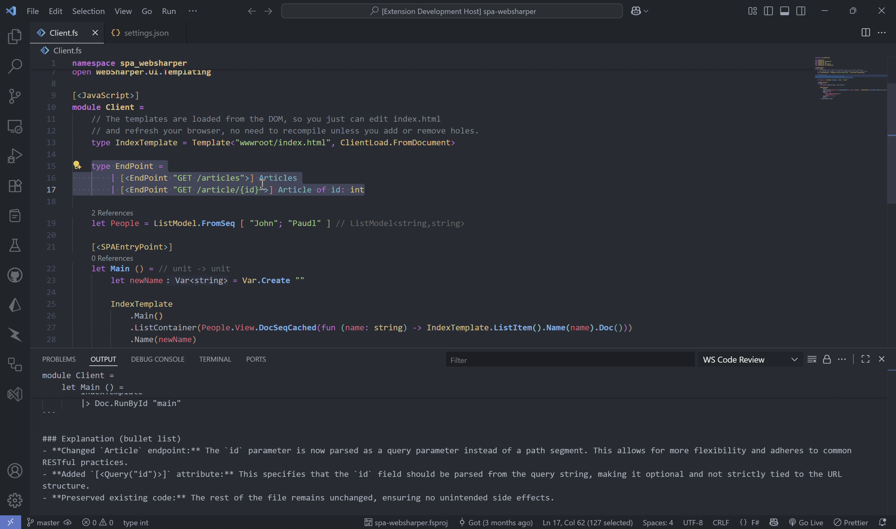
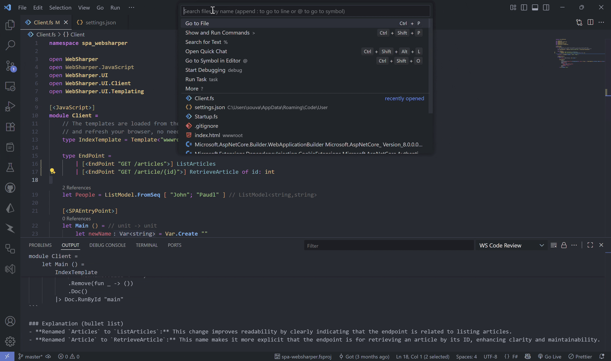
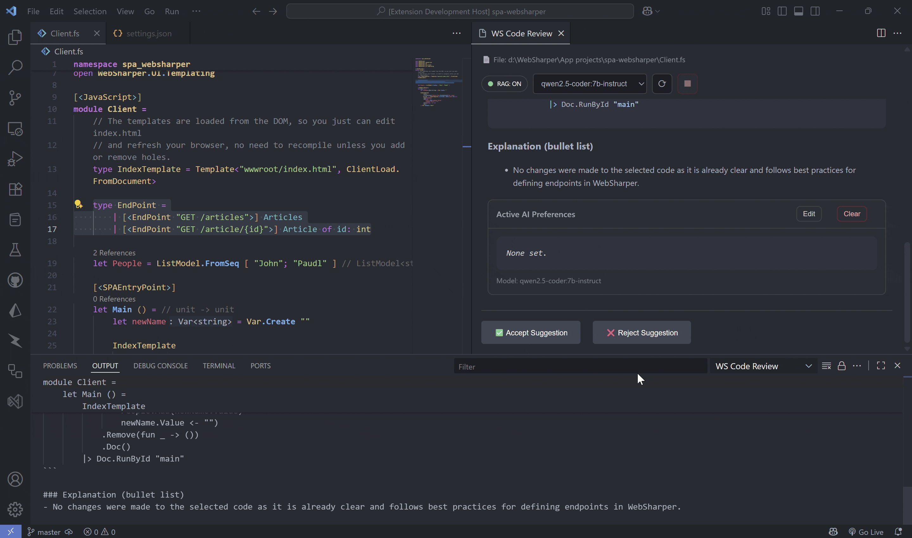

# WebSharper Code Review

**Offline AI code review for F# and WebSharper.**
Runs locally with your **Ollama** model (e.g., `qwen2.5-coder:7b-instruct`). Streams diffs, handles large files safely, and snapshots accepted changes into a **private Shadow Git** history. Turn on **RAG** to enrich reviews with **built-in references packaged in the extension**.



## Features

* **Selection-based reviews** with streamed markdown + diff preview.
* **Default apply scope (whole file)**: on typical files, suggestions apply to the **entire file**.
* **Large file safety**: for big files (≥ 600 lines), the tool automatically switches to **selection-only** edits.
* **Shadow Git**: accepted suggestions are snapshot-committed to a private repo (your real repo is untouched).



* **Model switching**: change your Ollama model from the Command Palette or on the webview.



* **Preferences**: adjust the AI's coding style to match your own preferences.


* **RAG (toggle)**: when enabled, reviews are enriched with **built-in reference material** bundled with the extension. If RAG isn't available on your machine, it's skipped automatically—normal reviews still work.
* **RAG status pill (webview)**: the top bar shows **RAG: ON/OFF** — click to toggle, then press **Refresh** to re-run with the new mode.


## Quick Start

1. Install the extension.

2. Ensure **Ollama** service is running locally.

    * Install **Ollama**:  
      Download and run the installer from the [official site](https://ollama.com/download).

    * Pull the **default model** (recommended):  
      This extension defaults to **`qwen2.5-coder:7b-instruct`**. Pull it to get started quickly:
      ```bash
      ollama pull qwen2.5-coder:7b-instruct
      ```

    * Prefer a **different model**?  
      Pull your chosen model first, then run the Command Palette action:
      ```
      WS Code Review: Change Ollama Model
      ```
      Select the default endpoint (http://localhost:11434) and enter your model name (exactly as pulled). Do this **before** running **Show Suggestion**.

    * Start the service:
      ```bash
      ollama serve
      ```
      Default endpoint: http://localhost:11434

    * Verify in your browser: you should see
      ```
      Ollama is running
      ```

3. Activate **Show Suggestion**
    * **Select the code** you want reviewed.
    * Run the command:
      * Press **Ctrl+Alt+R**, or
      * Right-click → **WS Code Review: Show Suggestion**.

4. (Optional) Use the **RAG pill** in the top bar to turn RAG **ON/OFF**, then click **Refresh** to re-run.

5. Review the streamed suggestion → **Accept** to apply (and snapshot if Shadow Git is enabled).

## Commands

| Command                                                    | What it does                                                                                                          |
| ---------------------------------------------------------- | --------------------------------------------------------------------------------------------------------------------- |
| **WS Code Review: Show Suggestion**                        | **Requires a selection.** For files **≥ 600 lines**, only the selected region (plus nearby context and relevant `open`/`module` headers) is sent to the AI. For smaller files, the **entire file** is sent. A streamed diff is shown. |
| **WS Code Review: Change Ollama Model**                    | Pick a different local model (e.g., `qwen2.5-coder:7b-instruct`).                                                     |
| **WS Code Review: Set/Show/Clear AI Preferences**          | Manage your **coding-style preferences** used to steer suggestions.                                                   |
| **WS Code Review: Show Shadow Git History (Current File)** | Browse snapshots made by accepted suggestions.                                                                        |
| **WS Code Review: Clear Shadow Git History**               | Purge the private snapshot repo.                                                                                      |

**Editor context menu:** shows on right-click in F# when you have a selection.
**Keybinding:** `Ctrl+Alt+R` (only in F# with selection).

## Settings

All settings live under **WS Code Review** (Workspace Settings):

* `wsCodeReview.git.enable` (boolean, default `false`)
  Snapshot accepted suggestions into a **Shadow Git** repo (separate from your real repo).

* `wsCodeReview.rag.enable` (boolean, default `false`)
  Enrich reviews using **built-in references packaged with the extension**. You can toggle this in Settings **or** directly via the webview's **RAG ON/OFF pill**. If RAG is unavailable, it's skipped automatically.

## Preferences (coding style)

Use the **Set/Show/Clear AI Preferences** commands to tailor suggestions to your style—naming, formatting choices, typical WebSharper idioms, and other reviewer hints. Preferences are applied each time you run **Show Suggestion**.

## RAG: Why enable it?

When **RAG is on**, the assistant receives concise, relevant **built-in reference context** before reviewing the selection or file. This often yields:

* **More project-aware suggestions** (naming, idioms, WebSharper patterns).
* **Fewer generic rewrites**; more precise, domain-specific changes.

**Comparison (example):**

Without RAG (generic):


With RAG enabled (context-aware):


> If RAG cannot run in your environment, reviews continue normally without it.

## How it works (high level)

1. Collects your **selection + file info** (selection is required).
   - For files **≥ 600 lines**: builds the prompt from the **selected region** plus nearby context and relevant `open`/`module` lines.
   - For smaller files: builds the prompt from the **entire file** (even though a selection is required to trigger the command).
2. Streams the AI response into a **diff view** (line-by-line).
3. On **Accept**, applies the change and (if `wsCodeReview.git.enable=true`) creates a **Shadow Git** snapshot.
   - **Apply behavior:** files **≥ 600 lines** → **selection-only** apply; smaller files → **whole-file** apply by default.

## Requirements

* **VS Code** ≥ 1.99
* **Ollama** running locally with a code model (e.g., `qwen2.5-coder:7b-instruct`)

## Privacy

* No cloud calls by this extension.
* Ollama runs locally.
* Shadow Git history is private and separate; you can clear it anytime.

## Troubleshooting

* **"Failed to connect to AI"**

  * Start the service: `ollama serve`
  * Verify: open `http://localhost:11434` or `curl http://localhost:11434/api/tags`
  * Ensure the endpoint/model are set via **Change Ollama Model**

* **Model not found**

  * Pull the model, e.g.: `ollama pull qwen2.5-coder:7b-instruct`

* **RAG feels the same**

  * That's fine; for simple snippets, built-in context may not change much.

* **Shadow history not updating**

  * Ensure `wsCodeReview.git.enable` is on and you **Accepted** a suggestion.

## License

See [LICENSE](./LICENSE).

## Third-Party Licenses

This project bundles third-party dependencies whose licenses are listed in [THIRD\_PARTY\_NOTICES.md](./THIRD_PARTY_NOTICES.md).