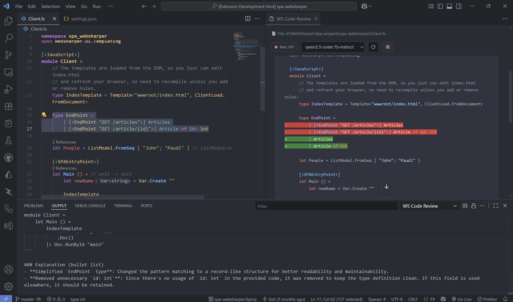
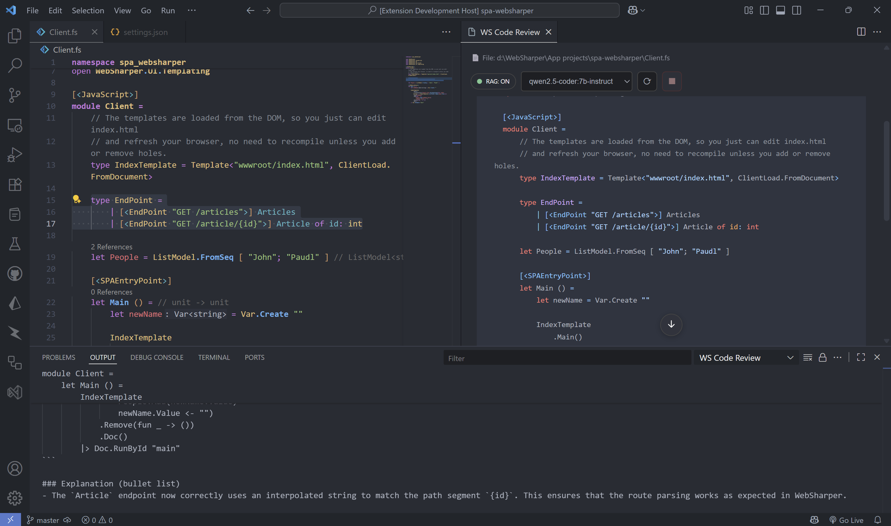

# WebSharper Code Review

**Offline AI code review for F# and WebSharper.**
Runs locally with your **Ollama** model (e.g., `qwen2.5-coder:7b-instruct`). Streams diffs, handles large files safely, and snapshots accepted changes into a **private Shadow Git** history. Turn on **RAG** to enrich reviews with **built-in references packaged in the extension**.


## Features

* **Selection-based reviews** with streamed markdown + diff preview.
* **Large file safety**: for big files (≥ 600 lines), the tool automatically switches to **selection-only** edits.
* **Shadow Git**: accepted suggestions are snapshot-committed to a private repo (your real repo is untouched).
* **Model switching**: change your Ollama model from the Command Palette.
* **RAG (toggle)**: when enabled, reviews are enriched with **built-in reference material** bundled with the extension. If RAG isn't available on your machine, it's skipped automatically—normal reviews still work.
* **RAG status pill (webview)**: the top bar shows **RAG: ON/OFF** — click to toggle, then press **Refresh** to re-run with the new mode.


## Quick Start

1. Install the extension.
2. Ensure **Ollama** service is running locally 

   * You can start the service by running the following command in your terminal:

      ```bash
      ollama serve
      ```

      By default, Ollama will be available at [http://localhost:11434](http://localhost:11434)

   * To verify it’s running correctly, open the URL in your browser. If you see the message:

      ```text
      Ollama is running
      ```

      then the service is up and ready to use.

3. Open an `.fs` file, select code, then:

   * Press **Ctrl+Alt+R**, or
   * Right-click → **WS Code Review: Show Suggestion**.
4. (Optional) Use the **RAG pill** in the top bar to turn RAG **ON/OFF**, then click **Refresh** to re-run.
5. Review the streamed suggestion → **Accept** to apply (and snapshot if Shadow Git is enabled).


## Commands

| Command                                                    | What it does                                                      |
| ---------------------------------------------------------- | ----------------------------------------------------------------- |
| **WS Code Review: Show Suggestion**                        | Runs review on the current selection and shows a streamed diff.   |
| **WS Code Review: Change Ollama Model**                    | Pick a different local model (e.g., `qwen2.5-coder:7b-instruct`). |
| **WS Code Review: Set/Show/Clear AI Preferences**          | Manage per-user review preferences.                               |
| **WS Code Review: Show Shadow Git History (Current File)** | Browse snapshots made by accepted suggestions.                    |
| **WS Code Review: Clear Shadow Git History**               | Purge the private snapshot repo.                                  |

**Editor context menu:** shows on right-click in F# when you have a selection.
**Keybinding:** `Ctrl+Alt+R` (only in F# with selection).


## Settings

All settings live under **WS Code Review** (Workspace Settings):

* `wsCodeReview.git.enable` (boolean, default `false`)
  Snapshot accepted suggestions into a **Shadow Git** repo (separate from your real repo).

* `wsCodeReview.rag.enable` (boolean, default `false`)
  Enrich reviews using **built-in references packaged with the extension**. You can toggle this in Settings **or** directly via the webview's **RAG ON/OFF pill**. If RAG is unavailable, it's skipped automatically.


## RAG: Why enable it?

When **RAG is on**, the assistant receives concise, relevant **built-in reference context** before reviewing the selection. This often yields:

* **More project-aware suggestions** (naming, idioms, WebSharper patterns).
* **Fewer generic rewrites**; more precise, domain-specific changes.

**Comparison (example):**

Without RAG (generic):


With RAG enabled (context-aware):


> If RAG cannot run in your environment, reviews continue normally without it.

## How it works (high level)

1. Collects **selection + file info** → builds a **concise review prompt**.
2. Streams the AI response into a **diff view** (line-by-line).
3. On **Accept**, applies the change. If `wsCodeReview.git.enable=true`, creates a **Shadow Git** snapshot commit.

## Requirements

* **VS Code** ≥ 1.99
* **Ollama** running locally with a code model (e.g., `qwen2.5-coder:7b-instruct`)

## Privacy

* No cloud calls by this extension.
* Ollama runs locally.
* Shadow Git history is private and separate; you can clear it anytime.

## Troubleshooting

* **"Failed to connect to AI"** → Start Ollama; ensure the model is installed and available.
* **RAG feels the same** → That's fine; for simple snippets, built-in context may not change much.
* **Shadow history not updating** → Ensure `wsCodeReview.git.enable` is on and you accepted a suggestion.

## Release Notes

### 0.0.1

* Selection-based, streamed suggestions for F# + WebSharper.
* Shadow Git snapshots (optional).
* Large-file safety (selection-only).
* RAG toggle for context-aware reviews.

## License

See [LICENSE](./LICENSE).

## Third-Party Licenses

This project bundles third-party dependencies whose licenses are listed in [THIRD_PARTY_NOTICES.](./THIRD_PARTY_NOTICES.md).